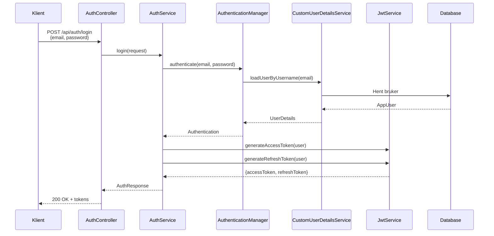
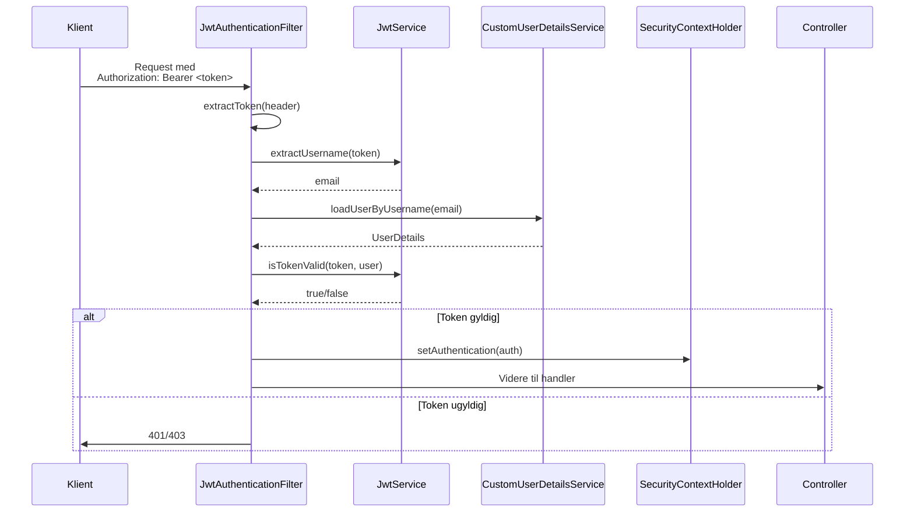
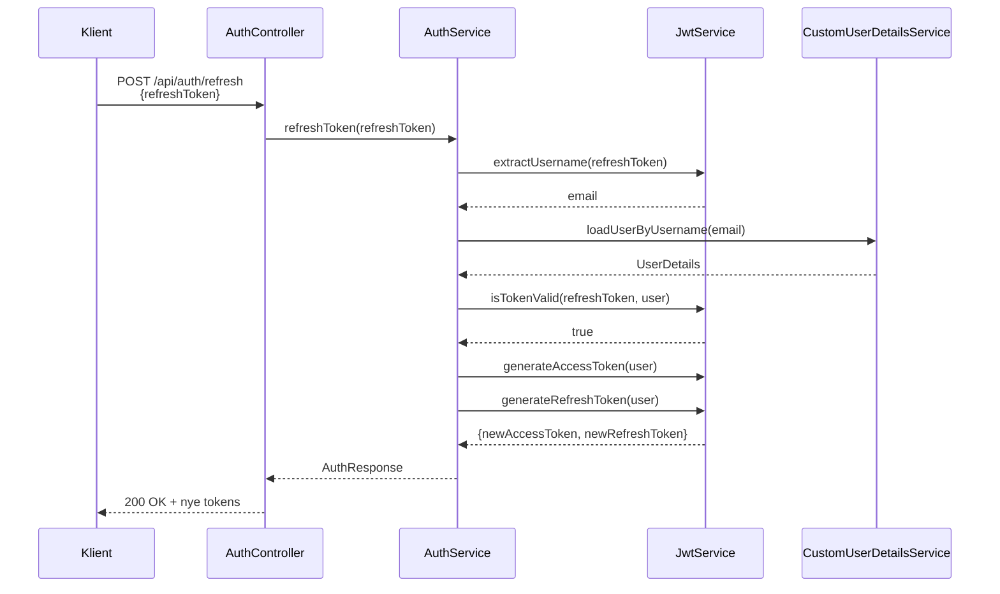
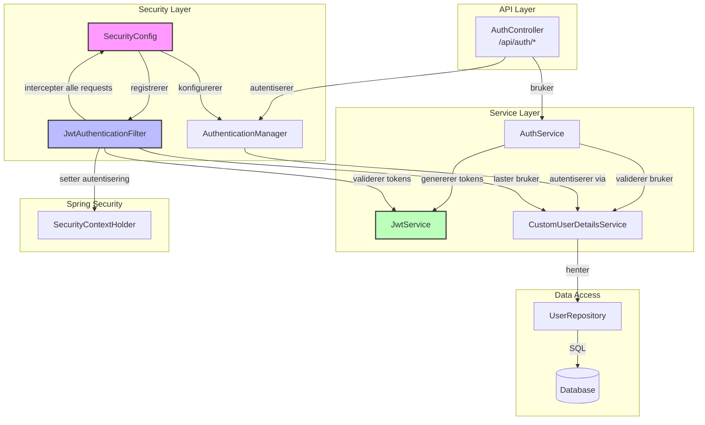

# Auth Implementasjon

## Definisjoner

**JWT (JSON Web Token)**
Signeret base64url-kodet JSON som bærer påstander (claims) mellom parter. Består av header, payload og signatur.

**Access Token**
Kortlivet token (24 timer) som autoriserer API-forespørsler. Inneholder bruker-ID og rolle.

**Refresh Token**
Langlivet token (7 dager) som brukes til å fornye access tokens uten ny innlogging.

**Bearer Token**
Autentiseringsmekanisme der klient sender `Authorization: Bearer <token>` header.

**Security Context**
Spring Security trådlagret autentiseringsinfo som lever kun under en request.

---

## Autentiseringsflyt

### Innlogging og Token-utstedelse



### Request-autorisering



### Token-fornyelse



### Klasserelasjoner og flyt



**Flytbeskrivelse:**

**Innkommende request:**
- JwtAuthenticationFilter (JF) ligger først i filter-kjeden
- JF extraherer og validerer JWT via JwtService
- Ved gyldig token lastes bruker via CustomUserDetailsService
- Autentisering settes i SecurityContextHolder
- Request går videre til controller

**Autentisering:**
- AuthController mottar login/refresh-kall
- AuthService koordinerer med AuthenticationManager
- AuthenticationManager bruker CustomUserDetailsService for å validere
- Ved suksess genererer AuthService nye tokens via JwtService

**Dependencies:**
- SecurityConfig injiserer JwtAuthenticationFilter og AuthenticationManager
- AuthService injiserer JwtService og CustomUserDetailsService
- CustomUserDetailsService injiserer UserRepository
- Alle services er Spring-beaner med constructor-injisering

---

## Klasser og ansvar

### SecurityConfig
Sentral konfigurasjon som:
- Definerer åpne endepunkter (`/api/auth/**`)
- Registrerer JwtAuthenticationFilter i filter-kjeden
- Setter session-håndtering til STATELESS
- Konfigurerer CORS-opprinnelser

### JwtAuthenticationFilter
OncePerRequestFilter som:
- Intercepter alle innkommende requests
- Extraherer Bearer-token fra Authorization-header
- Validerer token og laster bruker
- Populerer SecurityContextHolder ved suksess
- Logger hendelser og feil

### JwtService
Token-håndtering:
- Genererer access tokens (24t levetid)
- Genererer refresh tokens (7d levetid)
- Validerer token-signatur og utløp
- Extraherer claims (username, role, timestamps)
- Bruker HMAC-SHA med Base64-kodet hemmelig nøkkel

### AuthService
Forretningslogikk for autentisering:
- Registrering: Oppretter bruker + genererer token-par
- Innlogging: Autentiserer via AuthenticationManager, håndterer feilforsøk
- Konto-låsing: Låser etter 5 feilforsøk i 30 minutter
- Token-fornyelse: Validerer refresh token og utsteder nytt par

### CustomUserDetailsService
Spring Security integrasjon:
- Laster brukere fra database via email
- Validerer kontostatus (aktiv, ikke låst)
- Bygger UserDetails med authorities
- Kaster passende unntak ved feil

### AuthController
REST-endepunkter under `/api/auth/`:
- `POST /register` - Ny bruker, returnerer tokens (201)
- `POST /login` - Autentisering, returnerer tokens (200)
- `POST /refresh` - Fornyer access token (200)

---

## Sikkerhetsmekanismer

**Passord-separasjon**
Passord-hash lagres i egen tabell (`app_user_local_credential`) adskilt fra brukerinfo av sikkerhetshensyn.

**Brute-force-beskyttelse**
Konto låses i 30 minutter etter 5 påfølgende feilede innloggingsforsøk.

**Token-leveregler**
- Access token: 24 timer
- Refresh token: 7 dager
- Tokens blir ugyldige ved utløp, krever ny innlogging

**Kryptering**
- Passord: BCrypt hashing
- Token-signering: HMAC-SHA256
- Hemmelig nøkkel: Konfigurerbar via miljøvariabler

---

## Database-tabeller

```sql
-- Brukerinfo uten passord
app_user (
  user_id BIGINT PK,
  display_name VARCHAR(255) NOT NULL,
  email VARCHAR(255) UNIQUE,
  phone VARCHAR(50),
  is_active TINYINT DEFAULT 1,
  created_at DATETIME,
  updated_at DATETIME
)

-- Passord og lås status (separat tabell av sikkerhetshensyn)
app_user_local_credential (
  credential_id BIGINT PK,
  user_id BIGINT FK -> app_user,
  password_hash VARCHAR(255) NOT NULL,   
  must_change_pw TINYINT DEFAULT 0,
  last_changed_at DATETIME,
  failed_attempts TINYINT UNSIGNED DEFAULT 0,
  locked_until DATETIME NULL,  -- Brute force beskyttelse
  created_at DATETIME,
  updated_at DATETIME
)

-- Organisasjonsmedlemskap
user_organization (
  user_id BIGINT,
  org_number INT,
  is_active TINYINT DEFAULT 1,
  joined_at DATETIME,
  left_at DATETIME,
  last_seen_at DATETIME,
  PK(user_id, org_number)
)

-- Roller
role (
  role_id BIGINT PK,
  role_name VARCHAR(50) NOT NULL,  
  description VARCHAR(255),
  is_system_role TINYINT DEFAULT 0
)

-- Bruker-rolle-kobling
user_organization_role (
  user_id BIGINT,
  org_number INT,
  role_id BIGINT FK -> role,
  assigned_at DATETIME,
  assigned_by_user_id BIGINT,
  PK(user_id, org_number, role_id)
)
```
